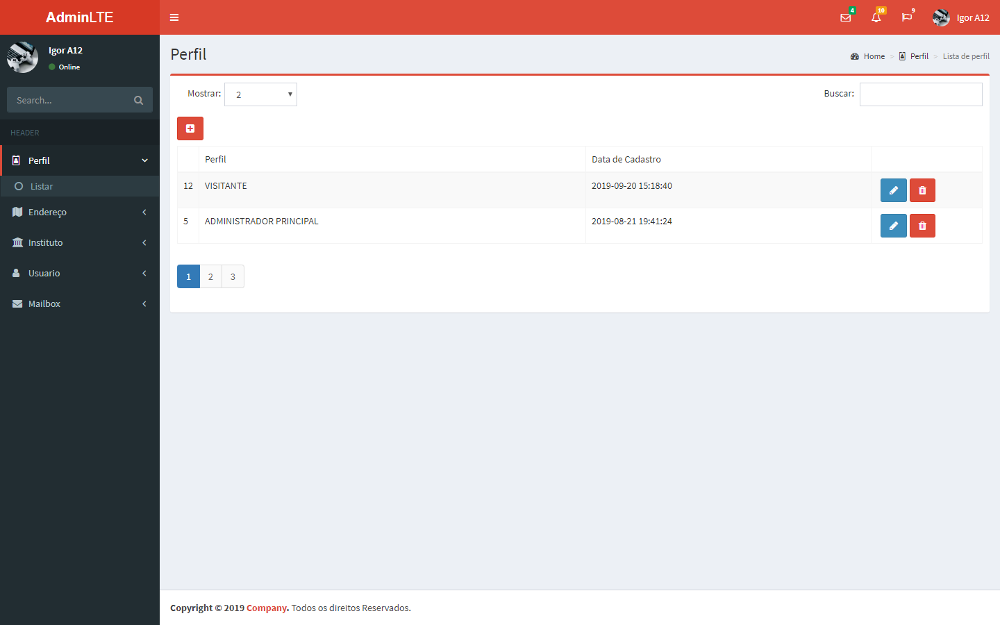
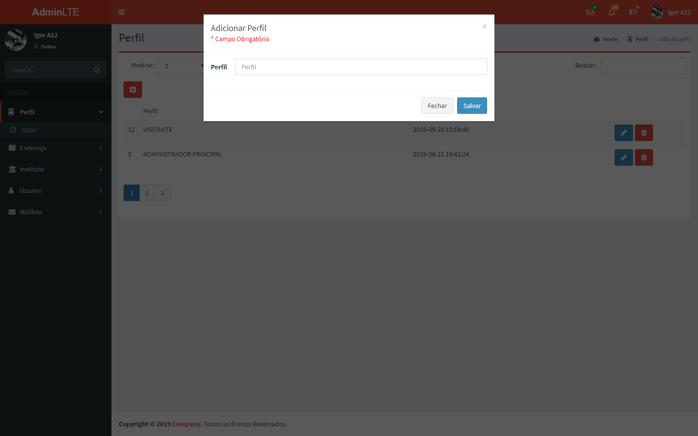

# Sistema Intranet

O objetivo do sistema é apenas didático, com o intuito de aprendizagem. O sistema em si não está 100% funcional, possui alguns ajustes a ser melhorados e outros a serem corrigidos.

## Recursos
 - [Codeigniter 3.1](https://codeigniter.com/){:target="_blank"}
 - [Bootstrap 3.3.6](https://bootstrapdocs.com/v3.3.6/docs/getting-started/){:target="_blank"}
 - [Jquery 3.3.1](https://jquery.com/){:target="_blank"}
    * [InputToken](https://loopj.com/jquery-tokeninput/){:target="_blank"}
    * [Select2 4](https://select2.org/){:target="_blank"}
    * [DataTables 1.10](https://datatables.net/){:target="_blank"}
 - [CKEditor 4](https://ckeditor.com/ckeditor-4/){:target="_blank"}
 - [CKFinder 3](https://ckeditor.com/docs/ckfinder/ckfinder3/){:target="_blank"}

## Testing
```
Execute o script allSQL de banco, que está no que está localizado __(./SQL/allSQL.sql)__ 
Altere as configurações do arquivo database.php que está localizado __(application/config/database.php)__
```

## Screenshots

### Perfil




### Endereco


### Instituto


### Usuario


### Mensagem


