# Sistema Intranet

O objetivo do sistema é apenas didático, com o intuito de aprendizagem. O sistema em si não está 100% funcional, possui alguns ajustes a ser melhorados e outros a serem corrigidos.

## Testar

```
Execute o script allSQL de banco, que está localizado  "./SQL/allSQL.sql".
```

```
Altere as configurações do arquivo database.php que está localizado "application/config/database.php" de acordo com as suas preferências.
```

## Recursos
 - [Codeigniter 3.1](https://codeigniter.com/)
 - [Bootstrap 3.3.6](https://bootstrapdocs.com/v3.3.6/docs/getting-started/)
 - [Jquery 3.3.1](https://jquery.com/)
    * [InputToken](https://loopj.com/jquery-tokeninput/)
    * [Select2 4](https://select2.org/)
    * [DataTables 1.10](https://datatables.net/)
 - [CKEditor 4](https://ckeditor.com/ckeditor-4/)
 - [CKFinder 3](https://ckeditor.com/docs/ckfinder/ckfinder3/)


## Screenshots

### Perfil


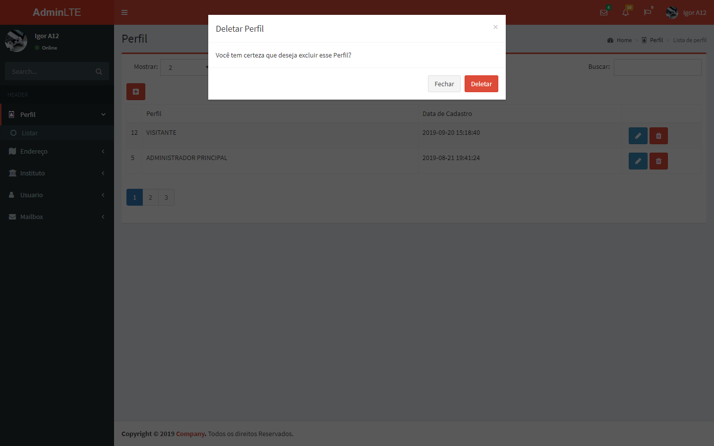


### Endereco
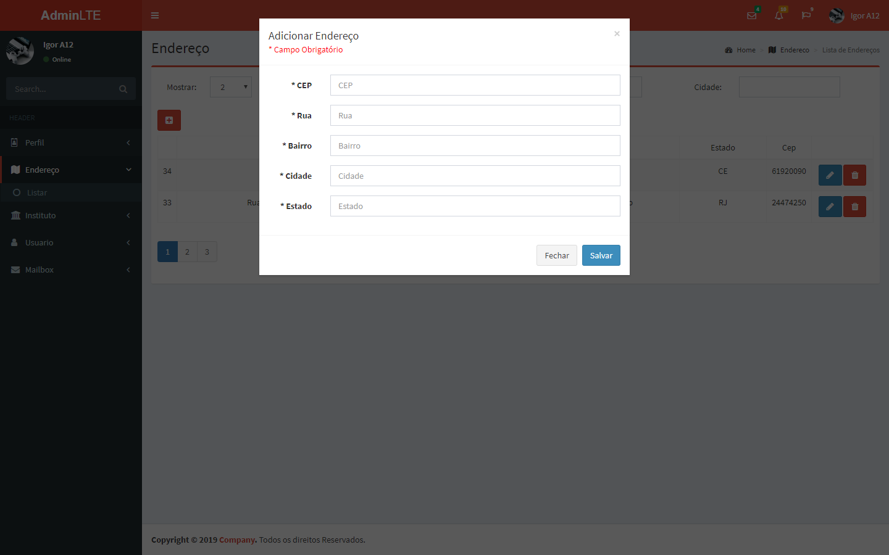
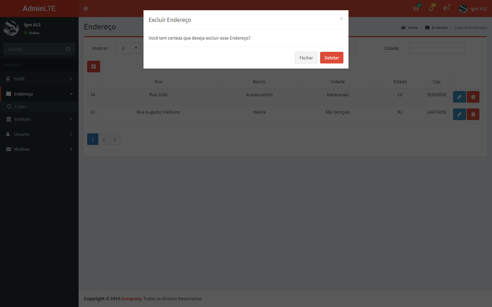

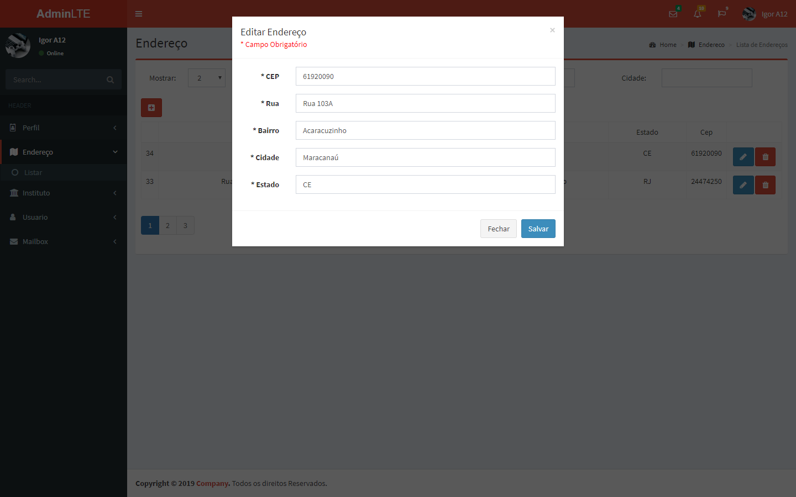

### Instituto
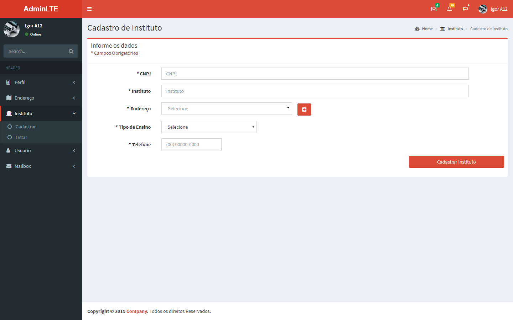
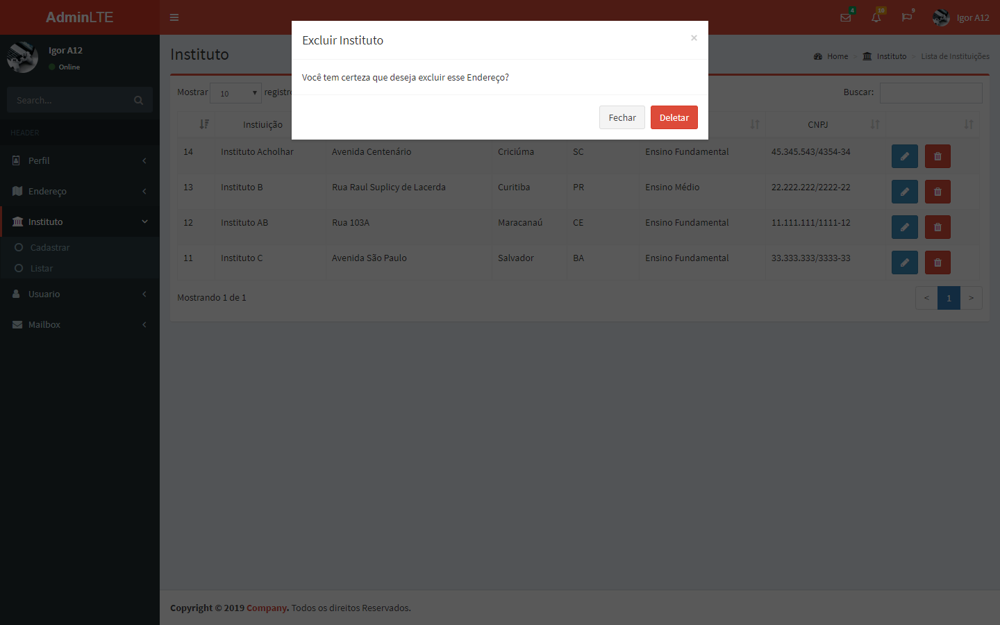

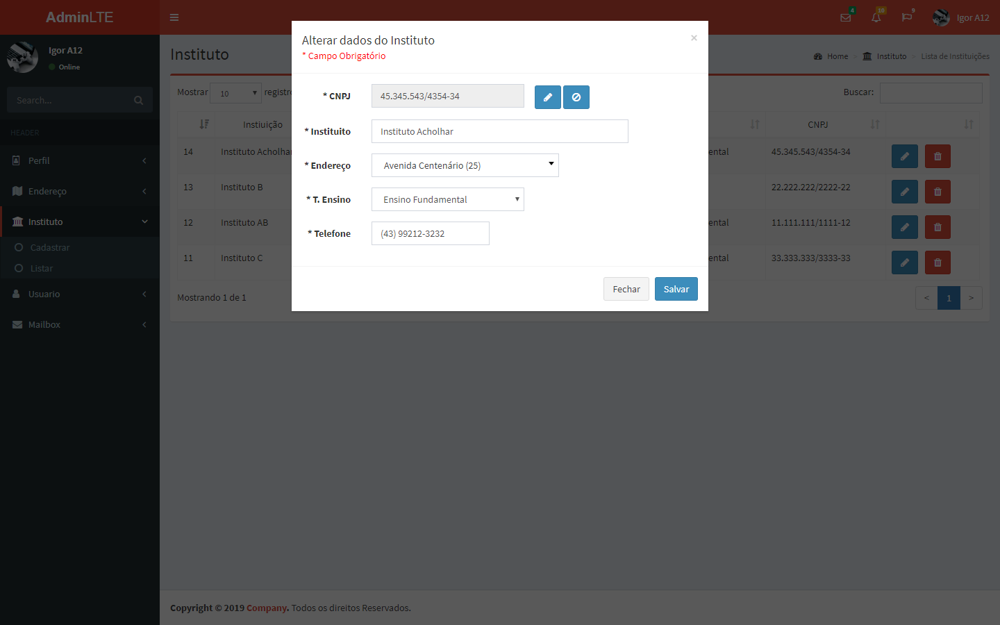

### Usuario
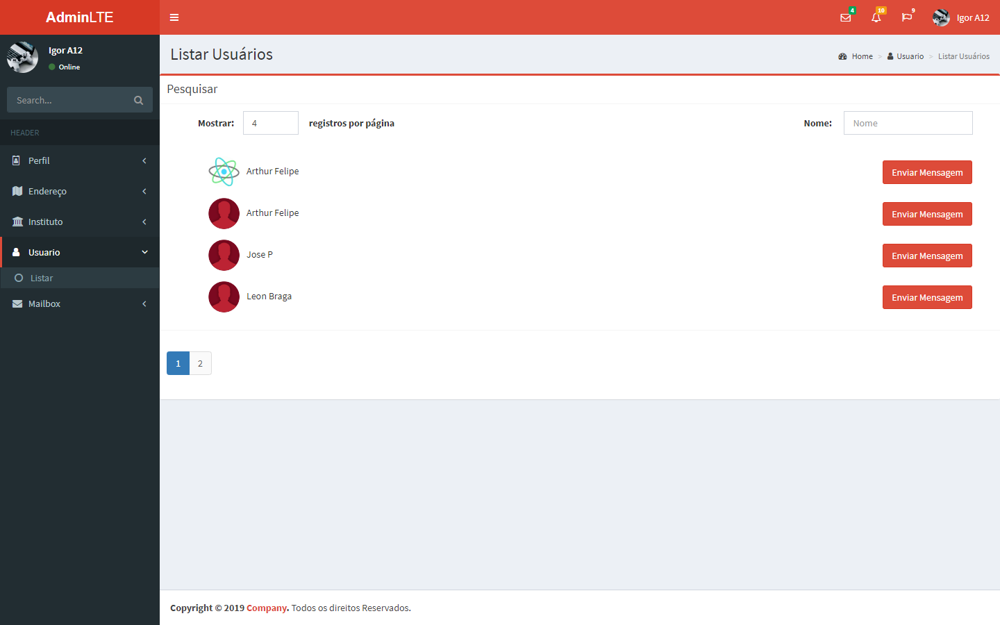
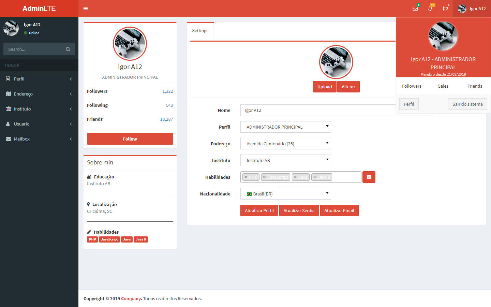

### Mensagem
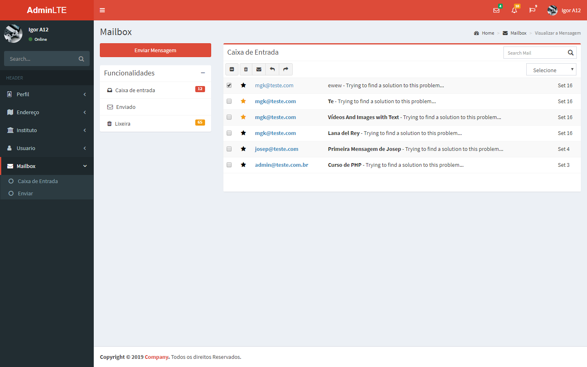
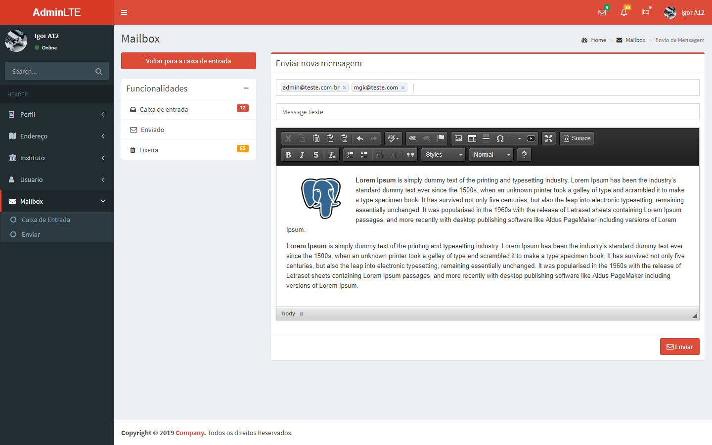
